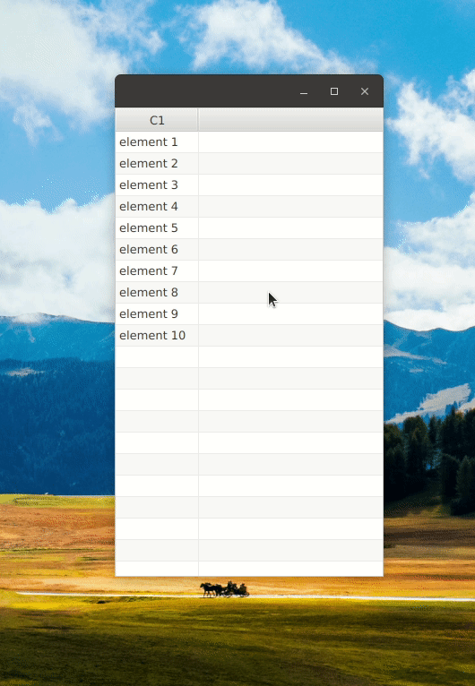

# Lazy-Loading TableView
Minimal example application to illustrate lazy-loading a TableView's content. Loading is triggered by scrolling the table.

In this example, using the vertical scrollbar does not trigger loading more elements. This could be achieved in a similar way, nevertheless.

